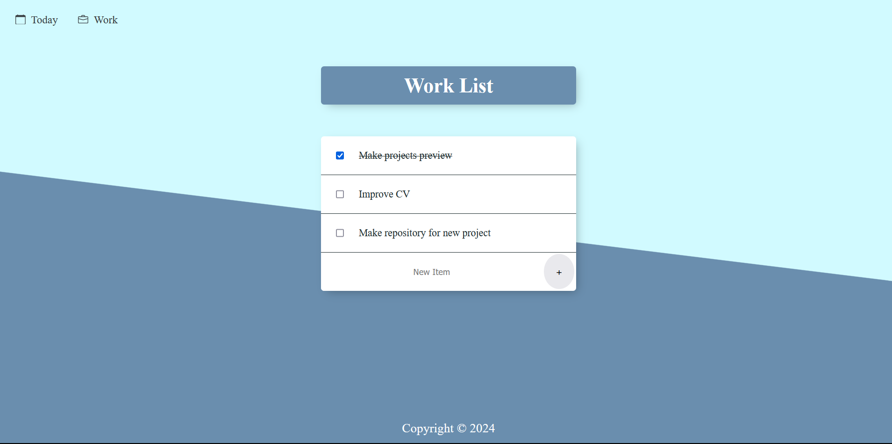

    <h2>Today subpage</h3>

    <h2>Work subpage</h3>

## How to install Todo List App?

1. Common setup. Clone the repository and install the dependencies.
   - git clone https://github.com/Xenko10/todo-list-app.git
   - cd todo-list-app
   - npm install
2. Run the following.
   - node index.js
   - open http://localhost:3000
